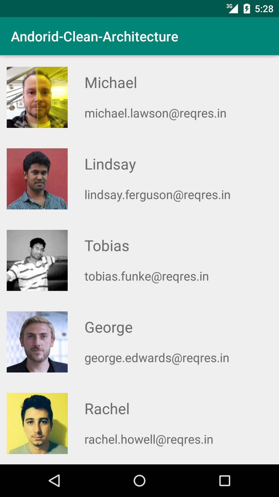
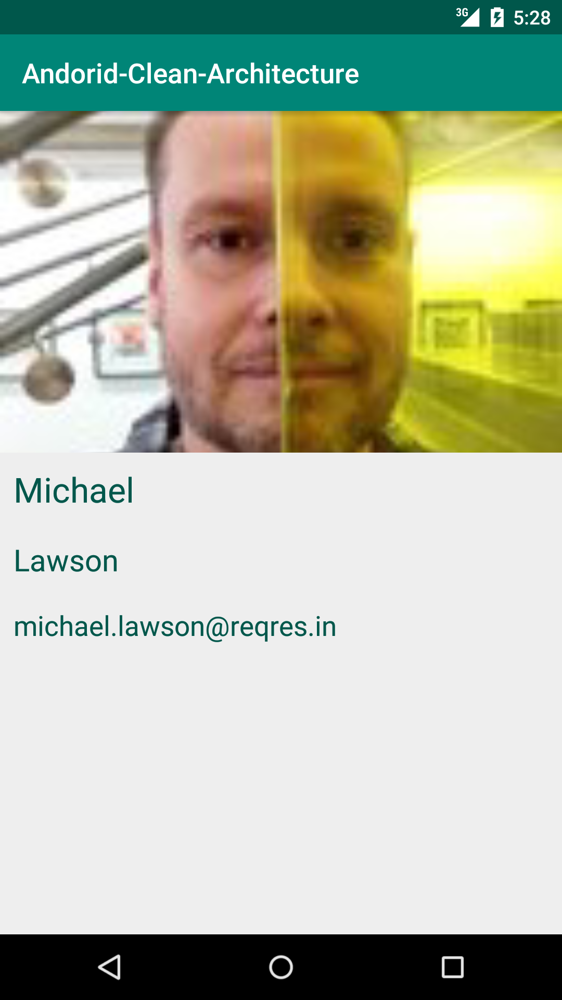
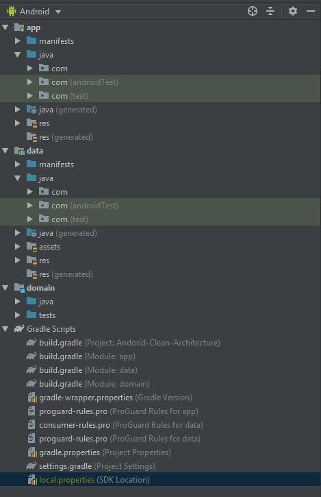
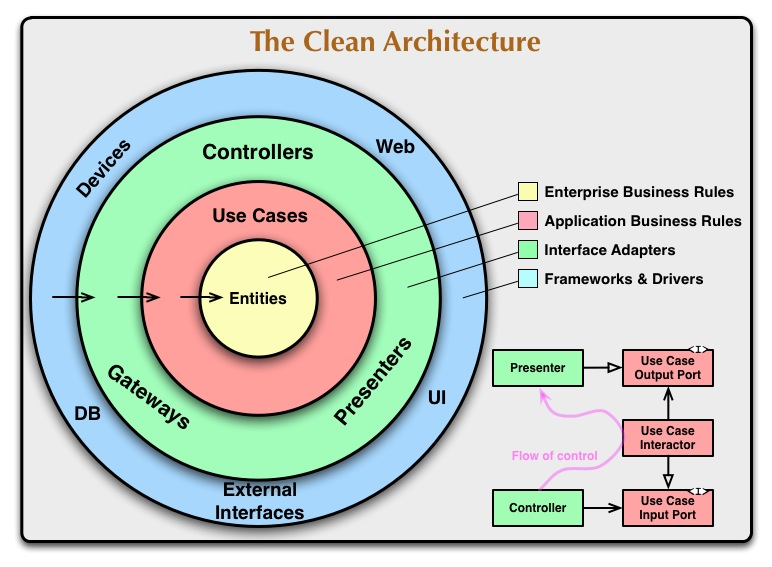

# Android Easy Clean Architecture Java
This project is based on Clean Architecture by Robert Cecil Martin aka Uncle Bob. 
In this repository, you can get a list of users and click on users to get users' details by user ids.
## Preview

</dive>

## Android Clean Architecture

## Libraries used on the sample project
- [AppCompat, RecyclerView and Design Library](https://developer.android.com/topic/libraries/support-library/?hl=es)
- [RxJava](https://github.com/ReactiveX/Rxjava)
- [RxAndroid](https://github.com/ReactiveX/RxAndroid)
- [Dagger2](https://github.com/google/dagger)
- [Gson](https://github.com/google/gson)
- [Butterknife](https://github.com/JakeWharton/butterknife)
- [Picasso](https://github.com/square/picasso)
- [jUnit](https://developer.android.com/reference/junit/framework/package-summary.html?hl=es)
- [Mockito](https://site.mockito.org/)
- [Robolecteric](http://robolectric.org/)
- [Hamcrest](http://hamcrest.org/)

## License
      MIT License

      Copyright (c) 2019 Meisam Beiranvand

      Permission is hereby granted, free of charge, to any person obtaining a copy
      of this software and associated documentation files (the "Software"), to deal
      in the Software without restriction, including without limitation the rights
      to use, copy, modify, merge, publish, distribute, sublicense, and/or sell
      copies of the Software, and to permit persons to whom the Software is
      furnished to do so, subject to the following conditions:

      The above copyright notice and this permission notice shall be included in all
      copies or substantial portions of the Software.

      THE SOFTWARE IS PROVIDED "AS IS", WITHOUT WARRANTY OF ANY KIND, EXPRESS OR
      IMPLIED, INCLUDING BUT NOT LIMITED TO THE WARRANTIES OF MERCHANTABILITY,
      FITNESS FOR A PARTICULAR PURPOSE AND NONINFRINGEMENT. IN NO EVENT SHALL THE
      AUTHORS OR COPYRIGHT HOLDERS BE LIABLE FOR ANY CLAIM, DAMAGES OR OTHER
      LIABILITY, WHETHER IN AN ACTION OF CONTRACT, TORT OR OTHERWISE, ARISING FROM,
      OUT OF OR IN CONNECTION WITH THE SOFTWARE OR THE USE OR OTHER DEALINGS IN THE
      SOFTWARE.
